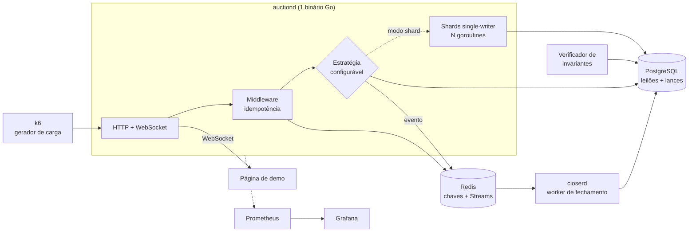

# Sistema de Leilão sob Alta Contenção

> Três estratégias de concorrência para o mesmo problema, medidas lado a lado.
> Go, PostgreSQL e Redis. Um binário, um worker, um harness de carga.

---

## O problema

Leilão tem uma propriedade que quase nenhum sistema CRUD tem: **contenção extrema sobre um único registro**.

Mil pessoas dando lance no mesmo item no último segundo é o pior caso possível de concorrência. Todas as escritas disputam a mesma linha, todas precisam ler o estado mais recente antes de decidir, e nenhuma pode ser perdida nem aplicada duas vezes.

A pergunta deste projeto:

> **Qual estratégia de concorrência sustenta throughput e latência quando N clientes disputam o mesmo leilão, e onde exatamente cada uma quebra?**

Não é um projeto sobre leilão. É um projeto sobre contenção, com leilão como carga de trabalho.

---

## Hipótese

O controle otimista com versionamento é a resposta que aparece em todo tutorial, e é a **pior** opção sob alta contenção: cada lance perdedor vira um `409`, o cliente retenta, a retentativa colide de novo, e o throughput desaba enquanto o p99 explode.

A hipótese a ser testada:

| Estratégia | Mecanismo | Custo por lance | Hipótese |
| --- | --- | --- | --- |
| **Otimista** | `UPDATE ... WHERE version = $n`, 409 + retry no cliente | 1 round-trip, mais N retentativas | Ganha com contenção baixa e muitos leilões paralelos; colapsa com contenção alta |
| **Pessimista** | `SELECT ... FOR UPDATE` dentro da transação | 1 round-trip, mais espera de lock | Estável, mas segura conexão do pool e limita a concorrência ao tamanho do pool |
| **Single-writer** | Uma goroutine dona exclusiva de cada leilão, lances entram por canal | 1 envio em canal, mais 1 escrita assíncrona | Ganha com contenção alta: sem conflito, sem retentativa, sem lock |

A terceira é a aposta do projeto. Se cada leilão tem exatamente um escritor, a serialização é estrutural: não existe corrida para resolver, porque não existe corrida. O banco deixa de ser o ponto de sincronização e vira apenas durabilidade.

O entregável não é "implementei um leilão". É **o gráfico do cruzamento das três curvas conforme a contenção sobe**.

---

## Arquitetura



Dois processos, dois bancos, nada mais.

| Componente | O que é | Por quê |
| --- | --- | --- |
| `auctiond` | Binário Go: API HTTP, WebSocket, shards single-writer | Go pela concorrência nativa e pelo custo baixo de goroutine, que é o que viabiliza o modo shard |
| `closerd` | Worker Go: consome Redis Stream, fecha leilões expirados | Processo separado para poder ser morto durante o teste de caos |
| PostgreSQL | Leilões, lances, log de eventos | Fonte de verdade e alvo da verificação de invariantes |
| Redis | Chaves de idempotência e Streams | Streams dão consumer group, pending list, claim por timeout e DLQ, que é o suficiente para exercitar entrega at-least-once sem depender de nuvem |

**Por que Redis Streams e não SNS/SQS:** as garantias são equivalentes para o que interessa aqui, mas com Streams o mecanismo de retentativa é explícito no código (`XAUTOCLAIM` sobre a pending list) em vez de ser um parâmetro de configuração gerenciado. Além disso roda em `docker compose up` com custo zero.

---

## As três estratégias

Selecionadas por variável de ambiente (`BID_STRATEGY=optimistic|pessimistic|shard`), com a mesma interface e a mesma suíte de testes rodando contra as três.

```go
type BidEngine interface {
    PlaceBid(ctx context.Context, req BidRequest) (BidResult, error)
}
```

### Otimista

```go
res, err := tx.Exec(ctx, `
    UPDATE auctions
       SET highest_bid = $1, highest_bidder = $2, version = version + 1
     WHERE id = $3 AND version = $4 AND status = 'open' AND highest_bid < $1`,
    req.Amount, req.UserID, req.AuctionID, req.ExpectedVersion)

if res.RowsAffected() == 0 {
    return BidResult{}, ErrConflict // 409, cliente relê e retenta
}
```

Métrica-chave: **taxa de conflito** e **número médio de tentativas por lance aceito**.

### Pessimista

```go
row := tx.QueryRow(ctx,
    `SELECT highest_bid, version FROM auctions WHERE id = $1 FOR UPDATE`,
    req.AuctionID)
// valida, escreve, commita
```

Métrica-chave: **tempo de espera em lock** e **saturação do pool de conexões**.

### Single-writer

Cada leilão é mapeado deterministicamente para um shard. O shard é dono do estado em memória e é o único que escreve.

```go
type shard struct {
    inbox    chan bidCmd
    auctions map[uuid.UUID]*auctionState // só esta goroutine toca aqui
}

func (s *shard) run(ctx context.Context) {
    for cmd := range s.inbox {
        st := s.auctions[cmd.AuctionID]
        if cmd.Amount <= st.HighestBid || st.Status != Open {
            cmd.reply <- BidResult{Accepted: false, Reason: TooLow}
            continue
        }
        st.HighestBid, st.HighestBidder = cmd.Amount, cmd.UserID
        st.Seq++
        cmd.reply <- BidResult{Accepted: true, Seq: st.Seq}
        s.journal <- persistCmd{...} // durabilidade fora do caminho crítico
    }
}

func shardFor(auctionID uuid.UUID, n int) int {
    return int(binary.BigEndian.Uint64(auctionID[:8])) % n
}
```

Não há conflito a resolver, porque não há corrida. O custo se desloca para: como garantir durabilidade sem devolver ao cliente um lance que ainda não foi persistido, e o que acontece quando o processo morre com o journal cheio. Essas perguntas são parte do projeto, não um detalhe dele.

Métrica-chave: **latência de confirmação** e **lag do journal**.

---

## Provas, não features

Três mecanismos transformam o projeto de demonstração em evidência.

### 1. Verificador de invariantes

Roda contra o Postgres depois de cada teste de carga e valida propriedades que precisam valer independentemente da estratégia:

- Os lances aceitos de um leilão formam sequência **estritamente crescente** de valor.
- Todo lance que recebeu `201` está no banco. Se o k6 recebeu 12.437 confirmações, há exatamente 12.437 linhas.
- Nenhuma chave de idempotência aparece duas vezes.
- O vencedor registrado é o maior valor aceito, e o leilão não recebeu lance depois do fechamento.

O checker sai com código diferente de zero se qualquer invariante falhar. É isso que separa "parece funcionar" de "está provado sob 500 clientes simultâneos".

### 2. Duplicatas injetadas

O gerador de carga reenvia **10% das requisições com a mesma `X-Idempotency-Key`**, algumas em paralelo com a original. O relatório mostra zero lances duplos.

A idempotência não é descrita, é demonstrada. O caso interessante é a duplicata que chega **enquanto** a original ainda está em voo: resolvido com `SET key state=in_flight NX PX 30000`, onde o segundo request aguarda ou recebe `409 Idempotency-In-Flight`.

### 3. Caos

`make chaos` derruba componentes durante a carga:

| Alvo | Falha injetada | O que precisa continuar valendo |
| --- | --- | --- |
| `closerd` | `docker kill` no meio do processamento | O leilão fecha exatamente uma vez, via `XAUTOCLAIM` sobre a pending list |
| `auctiond` | Kill de um pod no modo shard | Os leilões daquele shard são reassumidos, sem lance confirmado perdido |
| Redis | Pausa de 5s | Requisições falham de forma limpa, sem lance aceito fora de ordem |
| PostgreSQL | Pool saturado artificialmente | Backpressure em vez de timeout em cascata |

Em todos os cenários, o verificador de invariantes precisa continuar verde.

---

## Carga

k6, com contenção como variável independente. O mesmo volume total de requisições distribuído sobre 1, 10 ou 1000 leilões produz curvas completamente diferentes, e é justamente esse eixo que revela o cruzamento entre as estratégias.

```js
export const options = {
  scenarios: {
    ramp: {
      executor: "ramping-vus",
      stages: [
        { duration: "30s", target: 100 },
        { duration: "1m",  target: 500 },
        { duration: "30s", target: 0 },
      ],
    },
    last_second_spike: {
      executor: "constant-vus",
      vus: 1000,
      duration: "15s",
      startTime: "2m",
    },
  },
  thresholds: {
    http_req_failed: ["rate<0.01"], // erro real, não 409
    bid_confirm_latency: ["p(95)<200", "p(99)<500"],
  },
};
```

Matriz executada por `make bench`: 3 estratégias x 3 níveis de contenção x 2 cenários, com o verificador rodando após cada combinação.

---

## Resultados

> Tabela preenchida com os números reais do `make bench`. Ambiente e commit registrados junto.

| Estratégia | Leilões | VUs no pico | Aceitos/s | p95 confirmação | Taxa de conflito | Tentativas por aceito | Invariantes |
| --- | --- | --- | --- | --- | --- | --- | --- |
| Otimista | 1 | 1000 | | | | | |
| Otimista | 1000 | 1000 | | | | | |
| Pessimista | 1 | 1000 | | | | | |
| Pessimista | 1000 | 1000 | | | | | |
| Single-writer | 1 | 1000 | | | | | |
| Single-writer | 1000 | 1000 | | | | | |

Gráfico principal: **throughput por nível de contenção**, uma linha por estratégia, com o ponto de cruzamento marcado.

---

## Observabilidade

Cada processo expõe `/metrics`. Métricas próprias além das de runtime:

| Métrica | Tipo | Para quê |
| --- | --- | --- |
| `bid_confirm_duration_seconds` | Histogram | Latência fim a fim, com label por estratégia |
| `bid_conflicts_total` | Counter | Custo real do modo otimista |
| `bid_attempts_per_accept` | Histogram | Amplificação de retentativa |
| `shard_inbox_depth` | Gauge | Backpressure no modo single-writer |
| `journal_lag_seconds` | Gauge | Janela de perda em caso de crash |
| `stream_pending_entries` | Gauge | Mensagens não confirmadas no fechamento |
| `idempotency_hits_total` | Counter | Duplicatas efetivamente barradas |

Dashboard único no Grafana, provisionado por arquivo, com painel comparativo lado a lado das três estratégias.

---

## Painel ao vivo

Não é uma interface de leilão. É um **painel de instrumentos**: três colunas lado a lado, uma por estratégia, consumindo os três `auctiond` simultaneamente enquanto o k6 martela os três com carga idêntica.

```
┌─ OTIMISTA ────────┐ ┌─ PESSIMISTA ──────┐ ┌─ SINGLE-WRITER ───┐
│  R$ 4.180         │ │  R$ 5.920         │ │  R$ 9.740         │
│  ▁▂▂▃▃▃▃▃▃        │ │  ▁▂▃▄▅▅▆▆▆        │ │  ▁▃▅▆▇█████       │
│  aceitos/s   142  │ │  aceitos/s   380  │ │  aceitos/s  1.910 │
│  conflitos/s 2.4k │ │  espera lock 41ms │ │  inbox         3  │
│  p95       890ms  │ │  p95        210ms │ │  p95         12ms │
└───────────────────┘ └───────────────────┘ └───────────────────┘
```

O que se vê em dez segundos de GIF: a coluna otimista travando e enchendo de conflito enquanto a single-writer continua fluindo. É a tese do projeto inteira, sem ler uma linha do README.

### Stack

**React com TypeScript, via Vite.** Sem router, sem biblioteca de estado, sem framework de UI. Três dependências de runtime no total.

TypeScript aqui não é preferência, é requisito funcional: o painel consome payloads de WebSocket de três serviços em paralelo, e um campo renomeado no Go precisa quebrar o build do front, não aparecer como `undefined` no meio de um GIF de demonstração.

### Contrato tipado

Um único arquivo de tipos espelha os payloads do `auctiond`, gerado a partir das structs Go para não sair de sincronia na mão.

```bash
# make types
go run github.com/gzuidhof/tygo@latest generate
```

```ts
// web/src/types.gen.ts (gerado)
export type Strategy = "optimistic" | "pessimistic" | "shard";

export interface AuctionTick {
  auctionId: string;
  strategy: Strategy;
  highestBid: number;
  seq: number;
  acceptedPerSec: number;
  conflictsPerSec: number;
  inboxDepth: number;
  p95ConfirmMs: number;
  ts: string;
}
```

### Um hook, e só

Todo o estado do painel cabe em um hook por estratégia. Nada mais que isso é necessário.

```ts
export function useAuctionFeed(strategy: Strategy, url: string) {
  const [tick, setTick] = useState<AuctionTick | null>(null);
  const [history, setHistory] = useState<number[]>([]);
  const [status, setStatus] = useState<"connecting" | "live" | "down">("connecting");

  useEffect(() => {
    const ws = new WebSocket(url);
    ws.onopen = () => setStatus("live");
    ws.onclose = () => setStatus("down");
    ws.onmessage = (e) => {
      const t: AuctionTick = JSON.parse(e.data);
      setTick(t);
      setHistory((h) => [...h.slice(-59), t.highestBid]);
    };
    return () => ws.close();
  }, [url]);

  return { tick, history, status };
}
```

Três componentes: `<App>` monta as colunas, `<StrategyPanel>` renderiza uma delas, `<Sparkline>` desenha o histórico em SVG puro. O `status` importa: quando o `auctiond` cai durante o `make chaos`, a coluna fica vermelha e volta sozinha, o que é a evidência visual da reassunção de shard.

### O detalhe que importa

O servidor emite um tick agregado a cada 100ms por leilão, **não um evento por lance**. Sob 1000 VUs isso seria dezenas de milhares de mensagens por segundo por cliente, e o gargalo passaria a ser o navegador em vez do sistema testado.

Essa decisão é o motivo de o painel valer como teste e não só como vitrine: cliente lento não pode virar backpressure no hub de WebSocket. Se o `shard_inbox_depth` subir porque uma aba travou, o acoplamento está errado e o bug é real.

### Fora de escopo no front

Sem login, sem catálogo, sem formulário de lance, sem perfil, sem histórico. Quem dá lance aqui é o k6. Interface de e-commerce faria o projeto ser lido como CRUD com front bonito, que é exatamente o oposto do posicionamento.

---

## Estrutura

```
auction-system/
├── cmd/
│   ├── auctiond/          # API + WebSocket + shards
│   ├── closerd/           # worker de fechamento
│   └── checker/           # verificador de invariantes
├── internal/
│   ├── bid/
│   │   ├── engine.go      # interface BidEngine
│   │   ├── optimistic.go
│   │   ├── pessimistic.go
│   │   └── shard.go
│   ├── idem/              # middleware de idempotência
│   ├── stream/            # produtor e consumer group Redis
│   ├── ws/                # hub de WebSocket
│   └── metrics/
├── migrations/
├── bench/
│   ├── bid-storm.js
│   ├── run-matrix.sh      # 3 estratégias x 3 contenções
│   └── results/           # saída versionada, com ambiente e commit
├── chaos/
│   └── scenarios.sh
├── deploy/
│   ├── docker-compose.yml
│   └── grafana/           # dashboards provisionados
├── web/                   # painel React + TS (Vite)
│   ├── src/
│   │   ├── App.tsx
│   │   ├── types.gen.ts   # gerado das structs Go
│   │   ├── hooks/useAuctionFeed.ts
│   │   └── components/{StrategyPanel,Sparkline}.tsx
│   └── vite.config.ts
└── Makefile
```

---

## Como rodar

```bash
make up                              # postgres, redis, prometheus, grafana
make run STRATEGY=shard              # sobe auctiond e closerd
make bench                           # matriz completa, gera bench/results/
make check                           # verificador de invariantes
make chaos                           # injeção de falhas sob carga
make types                           # regenera web/src/types.gen.ts das structs Go
make web                             # painel em http://localhost:5173
```

---

## Fora de escopo

Registrado de propósito, porque saber o que não fazer é parte do desenho:

| Não tem | Por quê |
| --- | --- |
| Múltiplas linguagens | Escolher três linguagens para seis serviços adiciona manutenção, não capacidade. A comparação entre estratégias exige a mesma linguagem nas três, ou o benchmark não significa nada |
| API Gateway, Auth Service | Não mudam nenhuma curva do gráfico. Autenticação é JWT validado no próprio serviço |
| gRPC | Otimização de transporte para um problema que não é de transporte |
| Kubernetes, Terraform, EKS | Custo real e semanas de trabalho para não alterar nenhum resultado. Orquestração é assunto de outro projeto |
| SNS/SQS | Redis Streams entrega as mesmas garantias localmente e deixa o mecanismo de retentativa visível |
| Microserviços | Dois processos, e o segundo existe apenas porque precisa ser morto no teste de caos |

**Regra de escopo:** uma pergunta, três implementações, um benchmark. Toda ideia nova passa pelo filtro "isso muda o gráfico?". Se não muda, fica de fora.

---

## Roadmap

| Etapa | Entrega |
| --- | --- |
| 1 | Schema, migrations, `docker compose`, engine otimista, teste de invariantes básico |
| 2 | Engine pessimista, middleware de idempotência, duplicatas injetadas no k6 |
| 3 | Engine single-writer com shards, journal assíncrono, métricas de profundidade |
| 4 | Fechamento via Redis Streams, `closerd`, cenários de caos |
| 5 | Matriz de benchmark, dashboards Grafana |
| 5b | Tick agregado no WebSocket, geração de tipos, painel React de três colunas |
| 6 | Escrita dos resultados, gráfico de cruzamento, README final |
