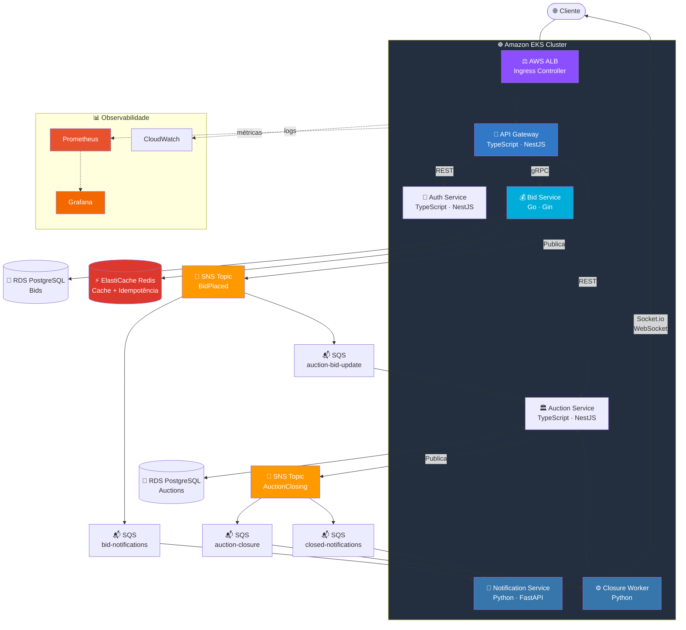

# Sistema de Leilão Distribuído — Polyglot Microservices

> Go, Python e TypeScript trabalhando juntos em infraestrutura 100% AWS.
> Kubernetes orquestrando tudo, Grafana K6 validando sob pressão, Prometheus + Grafana monitorando em tempo real.

---

## Por que Polyglot?

Em microsserviços, cada serviço é independente. Então por que forçar uma única linguagem pra tudo?

| Serviço | Linguagem | Por quê? |
|---|---|---|
| **Bid Service** | Go | Latência mínima, goroutines nativas, controle fino de memória |
| **API Gateway** | TypeScript (NestJS) | Ecossistema maduro, middleware rico, DX excelente |
| **Auth Service** | TypeScript (NestJS) | Passport/JWT bem integrado, guards e decorators |
| **Auction Service** | TypeScript (NestJS) | TypeORM + validação robusta, gerenciamento de estado |
| **Notification Service** | Python | Async nativo, integrações ricas (e-mail, SMS), porta pra ML |
| **Closure Worker** | Python | Tasks assíncronas, processamento em background |

A comunicação entre serviços é **agnóstica de linguagem** — tudo passa por SNS/SQS (eventos), ElastiCache Redis (cache) e RDS PostgreSQL (persistência).

---

## Por que isso NÃO é CRUD?

| CRUD típico | Este projeto |
|---|---|
| `POST /bids` e pronto | Controle de concorrência otimista com versioning |
| Sem preocupação com duplicatas | Idempotência distribuída por chave única |
| Tudo síncrono | Processamento via filas + workers |
| Polling para atualizar | Real-time via WebSockets |
| Deploy manual | Kubernetes com auto-scaling |
| "Funciona no meu PC" | Load testing com Grafana K6 + observabilidade |

---

## Stack

| Camada | Tecnologia |
|---|---|
| Runtime | Go 1.22+ · Node.js 20+ · Python 3.12+ |
| Frameworks | Gin/Chi (Go) · NestJS (TS) · FastAPI (Python) |
| Banco relacional | Amazon RDS (PostgreSQL) |
| Cache distribuído | Amazon ElastiCache (Redis) |
| Message Broker | Amazon SNS + SQS |
| Real-time | Socket.io (WebSockets) |
| API Gateway | NestJS + http-proxy-middleware |
| Orquestração | Amazon EKS (Kubernetes) |
| Container Registry | Amazon ECR |
| Load Testing | Grafana K6 |
| Observabilidade | Prometheus + Grafana + CloudWatch |
| Comunicação interna | REST + gRPC (Bid ↔ Gateway) |
| IaC | Terraform |
| CI/CD | GitHub Actions → ECR → EKS |

---

## Arquitetura de Microsserviços



### SNS + SQS — Fan-out Pattern

| RabbitMQ | SNS + SQS |
|---|---|
| Exchange + routing keys | SNS Topic → SQS subscriptions |
| NACK + requeue manual | Visibility timeout automático |
| Precisa provisionar/manter | Serverless, zero ops |
| DLQ via plugin | DLQ nativa por configuração |
| Escala manual | Escala infinita automática |

O padrão **SNS fan-out** replica o comportamento de exchanges: um evento publicado no SNS Topic é entregue automaticamente a **todas as filas SQS** inscritas. Cada consumer tem sua própria fila, garantindo processamento independente.

---

## 1. Concorrência & Race Conditions 🏁

Num leilão, **milissegundos importam**. O Bid Service (Go) usa controle de concorrência otimista com versionamento no PostgreSQL — se outro lance chegou antes, `0 rows affected` e retorna **409 Conflict**. O cliente re-tenta com o valor atualizado.

```go
// internal/bid/service.go
func (s *Service) PlaceBid(ctx context.Context, auctionID string, amount float64, version int) error {
    result, err := s.db.ExecContext(ctx,
        `UPDATE auctions SET highest_bid = $1, version = version + 1, updated_at = NOW()
         WHERE id = $2 AND version = $3`,
        amount, auctionID, version,
    )
    if err != nil { return err }
    rows, _ := result.RowsAffected()
    if rows == 0 { return ErrConflict }
    return nil
}
```

---

## 2. Idempotência 🔄

Middleware Gin verifica no ElastiCache Redis se a `X-Idempotency-Key` já foi processada. Se sim, retorna resposta cacheada. Se não, processa e armazena com TTL de 24h. Se falhar, remove a key pra permitir retry.

---

## 3. Consistência Eventual & Resiliência 📉

Workers Python consomem filas SQS via long polling. O retry é **nativo do SQS** — se o worker não chama `DeleteMessage`, a mensagem reaparece após o `VisibilityTimeout`. Depois de `maxReceiveCount` falhas, vai pra DLQ automaticamente.

```python
# workers/auction_closing/consumer.py
async def poll_sqs():
    async with session.client("sqs", region_name="us-east-1") as sqs:
        while True:
            response = await sqs.receive_message(
                QueueUrl=queue_url, MaxNumberOfMessages=10, WaitTimeSeconds=20,
            )
            for message in response.get("Messages", []):
                body = json.loads(message["Body"])
                payload = json.loads(body["Message"])
                try:
                    await handle_auction_closing(payload)
                    await sqs.delete_message(QueueUrl=queue_url, ReceiptHandle=message["ReceiptHandle"])
                except Exception:
                    pass  # Visibility timeout expira → retry automático
```

---

## 4. Atualizações em Tempo Real 📡

O Notification Service (Python + Socket.io) consome eventos da SQS e empurra via WebSocket. Cada leilão = 1 sala Socket.io. Redis Adapter sincroniza entre múltiplos pods no EKS.

---

## 5. Kubernetes (EKS) ☸️

| Sem K8s | Com EKS |
|---|---|
| `docker-compose up` e reza | Pods reiniciam sozinhos se crasharem |
| Escala manual | **HPA** escala pods por CPU/memória/custom metrics |
| Deploy = downtime | **Rolling updates** com zero downtime |
| Sem health checks | **Liveness + Readiness probes** |

```yaml
# k8s/bid-service/deployment.yaml
apiVersion: apps/v1
kind: Deployment
metadata:
  name: bid-service
  namespace: leilao
spec:
  replicas: 3
  strategy:
    type: RollingUpdate
    rollingUpdate:
      maxSurge: 1
      maxUnavailable: 0
  template:
    metadata:
      annotations:
        prometheus.io/scrape: "true"
        prometheus.io/port: "9090"
    spec:
      containers:
        - name: bid-service
          image: 123456789.dkr.ecr.us-east-1.amazonaws.com/bid-service:latest
          ports:
            - containerPort: 8080
            - containerPort: 50051
            - containerPort: 9090
          resources:
            requests: { cpu: "250m", memory: "256Mi" }
            limits: { cpu: "1000m", memory: "512Mi" }
          livenessProbe:
            httpGet: { path: /healthz, port: 8080 }
          readinessProbe:
            httpGet: { path: /readyz, port: 8080 }
---
apiVersion: autoscaling/v2
kind: HorizontalPodAutoscaler
metadata:
  name: bid-service-hpa
spec:
  scaleTargetRef:
    apiVersion: apps/v1
    kind: Deployment
    name: bid-service
  minReplicas: 3
  maxReplicas: 15
  metrics:
    - type: Resource
      resource: { name: cpu, target: { type: Utilization, averageUtilization: 70 } }
```

---

## 6. Load Testing & Observabilidade 📊

### Grafana K6 — Teste de Carga

**K6** é a ferramenta de load testing da Grafana Labs. Cenários em JavaScript simulam milhares de usuários concorrentes e medem latência, throughput, e error rate.

```javascript
// tests/load/bid-storm.js
import http from "k6/http";
import { check, sleep } from "k6";
import { randomString } from "https://jslib.k6.io/k6-utils/1.4.0/index.js";
import { Counter, Trend } from "k6/metrics";

const bidConflicts = new Counter("bid_conflicts");
const bidLatency = new Trend("bid_latency", true);

export const options = {
  scenarios: {
    ramp_up: {
      executor: "ramping-vus",
      startVUs: 0,
      stages: [
        { duration: "30s", target: 50 },
        { duration: "1m", target: 200 },
        { duration: "2m", target: 500 },
        { duration: "30s", target: 0 },
      ],
    },
    last_second_spike: {
      executor: "constant-vus",
      vus: 1000,
      duration: "15s",
      startTime: "3m30s",
    },
  },
  thresholds: {
    http_req_duration: ["p(95)<300", "p(99)<500"],
    http_req_failed: ["rate<0.05"],
    bid_latency: ["p(95)<200"],
  },
};

export default function () {
  const res = http.post(`${__ENV.BASE_URL}/api/bids`,
    JSON.stringify({ auction_id: __ENV.AUCTION_ID, amount: Math.floor(Math.random() * 10000) + 100, version: 1 }),
    { headers: { "Content-Type": "application/json", "X-Idempotency-Key": randomString(16), Authorization: `Bearer ${__ENV.TOKEN}` } }
  );
  bidLatency.add(res.timings.duration);
  check(res, { "status is 201 or 409": (r) => r.status === 201 || r.status === 409 });
  if (res.status === 409) bidConflicts.add(1);
  sleep(Math.random() * 2);
}
```

```bash
# Rodar load test
k6 run tests/load/bid-storm.js

# Exportar métricas pro Prometheus → Grafana
k6 run --out experimental-prometheus-rw \
  -e K6_PROMETHEUS_RW_SERVER_URL=http://prometheus:9090/api/v1/write \
  tests/load/bid-storm.js
```

### Observabilidade — Prometheus + Grafana

Cada serviço expõe `/metrics` no formato Prometheus. O Prometheus faz scrape a cada 15s e alimenta dashboards Grafana.

**Dashboards Grafana:**

| Dashboard | Métricas chave |
|---|---|
| **Bid Performance** | Latência p50/p95/p99, taxa de conflitos, throughput |
| **SQS Queues** | Profundidade das filas, age of oldest message, DLQ count |
| **WebSocket Connections** | Conexões ativas, mensagens/s, reconexões |
| **K6 Load Tests** | VUs ativos, request rate, error rate, thresholds |
| **EKS Resources** | CPU/memória por pod, restarts, HPA scaling events |

---

## Contratos entre Serviços

### Eventos SNS/SQS (JSON Schema)

```json
{
  "$schema": "http://json-schema.org/draft-07/schema#",
  "title": "BidPlaced",
  "type": "object",
  "required": ["auction_id", "user_id", "amount", "timestamp"],
  "properties": {
    "auction_id": { "type": "string", "format": "uuid" },
    "user_id": { "type": "string", "format": "uuid" },
    "amount": { "type": "number", "minimum": 0 },
    "timestamp": { "type": "string", "format": "date-time" }
  }
}
```

### gRPC — Bid Service (Proto)

```protobuf
syntax = "proto3";
package bid;

service BidService {
  rpc PlaceBid (PlaceBidRequest) returns (PlaceBidResponse);
  rpc GetHighestBid (GetHighestBidRequest) returns (BidInfo);
}

message PlaceBidRequest {
  string auction_id = 1;
  string user_id = 2;
  double amount = 3;
  int32 expected_version = 4;
  string idempotency_key = 5;
}

message PlaceBidResponse {
  bool success = 1;
  string bid_id = 2;
  int32 new_version = 3;
}
```

---

## Estrutura do Projeto

```
leilao/
├── contracts/                    # Contratos compartilhados (language-agnostic)
│   ├── proto/bid.proto
│   └── events/*.schema.json
├── services/
│   ├── gateway/                  # 🚪 TypeScript/NestJS
│   ├── auth/                     # 🔐 TypeScript/NestJS
│   ├── auction/                  # 🏛️ TypeScript/NestJS
│   ├── bid/                      # 💰 Go (Gin + gRPC)
│   │   ├── cmd/server/main.go
│   │   ├── internal/{bid,middleware,metrics,grpc}/
│   │   └── pkg/{redis,messaging}/
│   ├── notification/             # 📢 Python (FastAPI + Socket.io)
│   └── closure-worker/           # ⚙️ Python (SQS consumer)
├── k8s/                          # ☸️ Kubernetes manifests
│   ├── {bid-service,gateway,auction-service,notification,closure-worker}/
│   └── monitoring/{prometheus,grafana}/
├── infra/                        # 🏗️ Terraform
│   ├── modules/{eks,rds,elasticache,sqs-sns,ecr}/
│   └── environments/{dev,staging,prod}.tfvars
├── tests/
│   ├── integration/
│   ├── e2e/
│   └── load/                     # 🏋️ Grafana K6
│       ├── bid-storm.js
│       ├── auction-lifecycle.js
│       └── websocket-stress.js
├── .github/workflows/{ci,deploy}.yml
├── scripts/{proto-gen.sh,localstack-init.sh}
├── docker-compose.yml            # Dev local com LocalStack
├── Makefile
└── README.md
```

---

## Como Rodar

```bash
# Dev local (LocalStack simula SNS/SQS)
make dev-up

# Testes
make test-go && make test-ts && make test-py

# Load test
make load-test

# Deploy AWS
cd infra/ && terraform apply -var-file=environments/staging.tfvars
make docker-build && make docker-push
make k8s-deploy ENV=staging
```

---

## Resumo dos Desafios Técnicos

| # | Desafio | Solução | Linguagem | Tecnologia |
|---|---|---|---|---|
| 🏁 | Concorrência | Controle Otimista c/ Versionamento | Go | RDS PostgreSQL |
| 🔄 | Idempotência | Filtro c/ chave única distribuída | Go | ElastiCache Redis |
| 📉 | Consistência Eventual | Workers assíncronos c/ retry nativo | Python | SNS + SQS + DLQ |
| 📡 | Tempo Real | Push bidirecional c/ salas | Python | Socket.io + ElastiCache |
| 🔗 | Comunicação | gRPC + eventos assíncronos | Go ↔ TS | Protobuf + SNS/SQS |
| ☸️ | Orquestração | Auto-scaling, self-healing | — | Amazon EKS + HPA |
| 🏋️ | Load Testing | Spike tests c/ métricas custom | JS | Grafana K6 |
| 📊 | Observabilidade | Métricas, dashboards, alertas | — | Prometheus + Grafana |
| 🏗️ | Infraestrutura | Tudo como código | — | Terraform + GitHub Actions |

---

## Dependências por Serviço

### Go — Bid Service
```
github.com/gin-gonic/gin
github.com/redis/go-redis/v9
github.com/aws/aws-sdk-go-v2/service/sns
google.golang.org/grpc
github.com/lib/pq
github.com/prometheus/client_golang
```

### TypeScript — Gateway / Auth / Auction
```json
{
  "@nestjs/common": "^10.0.0",
  "@nestjs/microservices": "^10.0.0",
  "@nestjs/typeorm": "^10.0.0",
  "@grpc/grpc-js": "^1.9.0",
  "@aws-sdk/client-sns": "^3.400.0",
  "@aws-sdk/client-sqs": "^3.400.0",
  "typeorm": "^0.3.0",
  "prom-client": "^15.0.0"
}
```

### Python — Notification / Closure Worker
```
fastapi>=0.104.0
uvicorn>=0.24.0
python-socketio>=5.10.0
aioboto3>=12.0.0
asyncpg>=0.29.0
pydantic>=2.5.0
prometheus-client>=0.19.0
```
