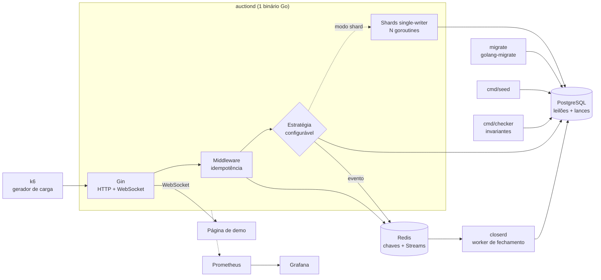

# Arquitetura

[← índice](../README.md)



Dois processos de longa duração, dois bancos, nada mais. `migrate`, `seed` e `checker` são tarefas que rodam até completar e morrem.

| Componente | O que é | Por quê |
| --- | --- | --- |
| `auctiond` | Binário Go: API HTTP com Gin, WebSocket, shards single-writer | Go pela concorrência nativa e pelo custo baixo de goroutine, que é o que viabiliza o modo shard |
| `closerd` | Worker Go: consome Redis Stream, materializa leilões expirados | Processo separado para poder ser morto durante o teste de caos |
| PostgreSQL | Leilões, lances, log de eventos | Fonte de verdade e alvo da verificação de invariantes |
| Redis | Chaves de idempotência e Streams | Streams dão consumer group, pending list, claim por timeout e DLQ, que é o suficiente para exercitar entrega at-least-once sem depender de nuvem |
| `migrate` | Serviço do compose, roda até completar | Sobe antes do `auctiond`; o `auctiond` falha rápido se a versão do schema não for a esperada |
| `cmd/seed` | Semeia N leilões antes de cada célula do benchmark | A contenção é definida por quantos leilões existem, então semear é parte do experimento |
| `cmd/checker` | Verificador de invariantes | Sai com código diferente de zero e barra a matriz |

**Por que Redis Streams e não SNS/SQS:** as garantias são equivalentes para o que interessa aqui, mas com Streams o mecanismo de retentativa é explícito no código (`XAUTOCLAIM` sobre a pending list) em vez de ser um parâmetro de configuração gerenciado. Além disso roda em `docker compose up` com custo zero.

---

## Ambiente fixado

O benchmark só significa alguma coisa se as três estratégias rodarem sob exatamente as mesmas condições, e se outra máquina puder reproduzir o número. Recursos são limitados no compose e o pool de conexões é **o mesmo valor nas três estratégias**.

```yaml
services:
  postgres:
    image: postgres:16-alpine
    command: >
      postgres -c max_connections=200
               -c shared_buffers=512MB
               -c synchronous_commit=on
    deploy:
      resources:
        limits: { cpus: '2.0', memory: 2G }

  auctiond:
    environment:
      BID_STRATEGY: ${STRATEGY:-optimistic}
      DB_POOL_SIZE: ${DB_POOL_SIZE:-25}    # idêntico nas três engines
    deploy:
      resources:
        limits: { cpus: '2.0', memory: 1G }
```

O pool é o parâmetro mais perigoso do projeto, porque ele **é** a história do pessimista: com pool pequeno, a fila se forma no `pgxpool` e não no lock do Postgres, e você atribuiria ao mecanismo de concorrência um custo que é de configuração. Por isso ele é constante durante a comparação, e vira eixo próprio só no sweep de pool da etapa 5, onde é a conclusão em vez do vício.

Todo run grava o ambiente junto com o resultado:

```json
// bench/results/<run>/env.json
{
  "commit": "a1b2c3d",
  "strategy": "optimistic",
  "pool": 25,
  "cpus": 2.0,
  "postgres": "16.4",
  "go": "1.23",
  "host": "..."
}
```

---

## Estrutura

```
bid-storm/
├── cmd/
│   ├── auctiond/          # API Gin + WebSocket + shards
│   ├── closerd/           # worker de fechamento
│   ├── seed/              # semeia N leilões
│   └── checker/           # verificador de invariantes
├── internal/
│   ├── bid/
│   │   ├── engine.go      # interface BidEngine, Outcome, BidResult
│   │   ├── optimistic.go
│   │   ├── pessimistic.go
│   │   ├── shard.go
│   │   └── enginetest/    # suíte de conformidade, roda contra as três
│   ├── config/            # variáveis de ambiente e defaults
│   ├── db/                # pool pgx, verificação de versão de schema
│   ├── httpapi/           # handlers Gin, envelope de resposta
│   ├── idem/              # middleware de idempotência
│   ├── stream/            # produtor e consumer group Redis
│   ├── ws/                # hub de WebSocket
│   ├── testsupport/       # Postgres efêmero por testcontainers
│   └── metrics/
├── migrations/
├── bench/
│   ├── bid-storm.js
│   ├── run-matrix.sh      # 3 estratégias x 3 contenções x 2 cenários x 2 políticas
│   └── results/           # saída versionada, com ambiente e commit
├── chaos/
│   └── scenarios.sh
├── deploy/
│   ├── prometheus/        # configuração de scrape
│   └── grafana/           # datasource e dashboards provisionados
├── web/                   # painel React + TS (Vite)
│   ├── src/
│   │   ├── App.tsx
│   │   ├── types.gen.ts   # gerado das structs Go
│   │   ├── hooks/useAuctionFeed.ts
│   │   └── components/{StrategyPanel,Sparkline}.tsx
│   └── vite.config.ts
├── docker-compose.yaml
├── Dockerfile
└── Makefile
```
